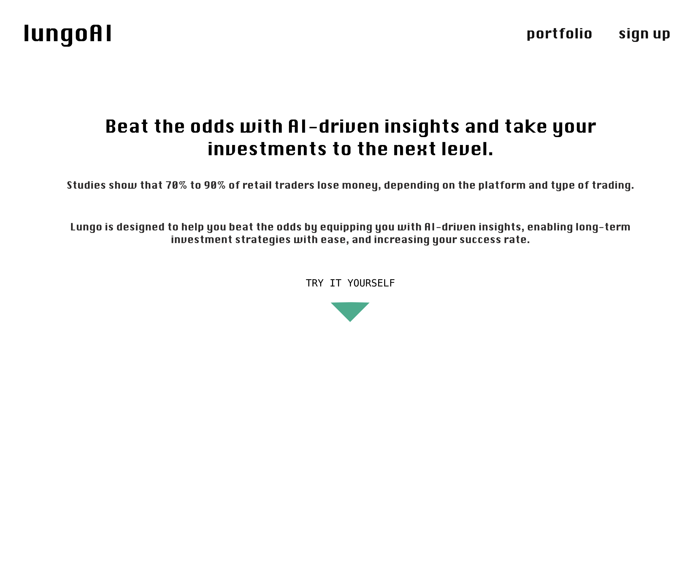
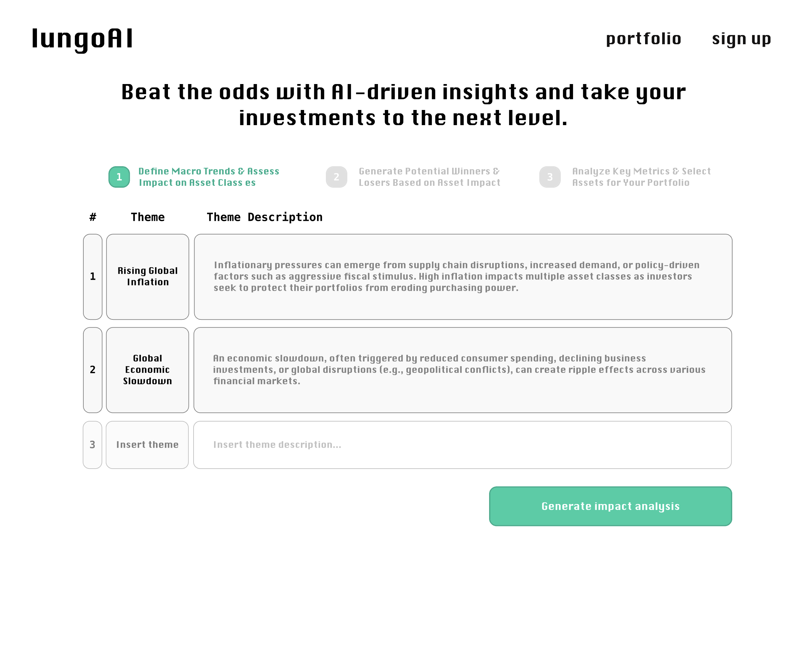
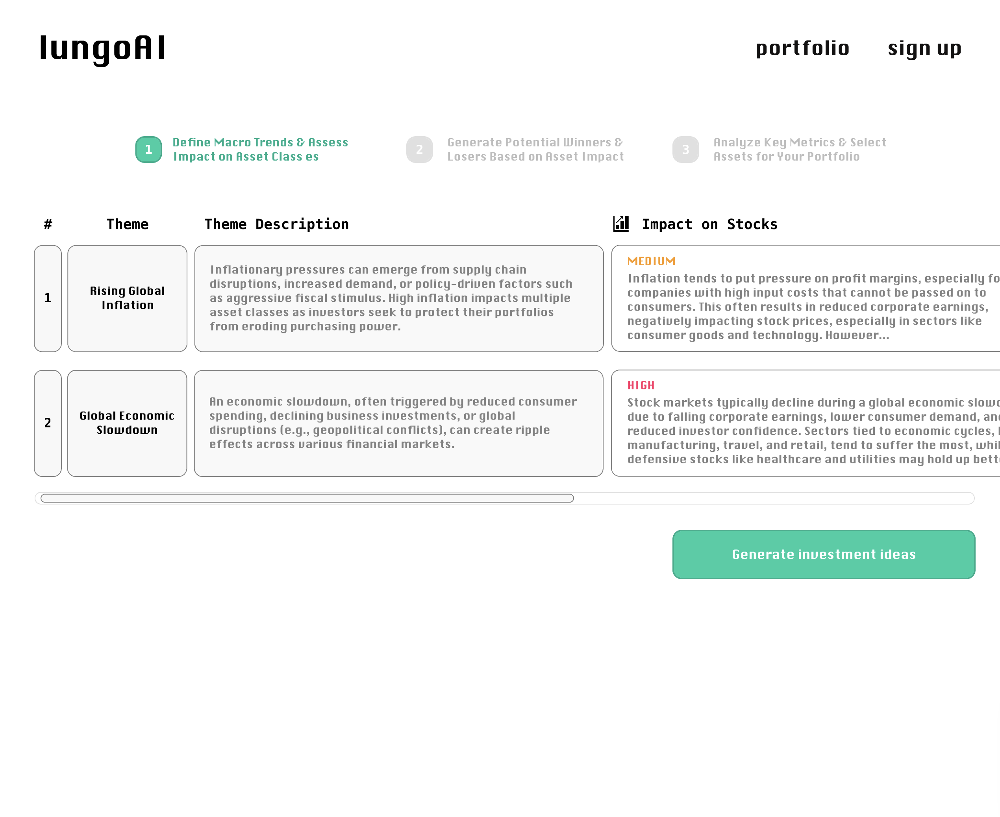
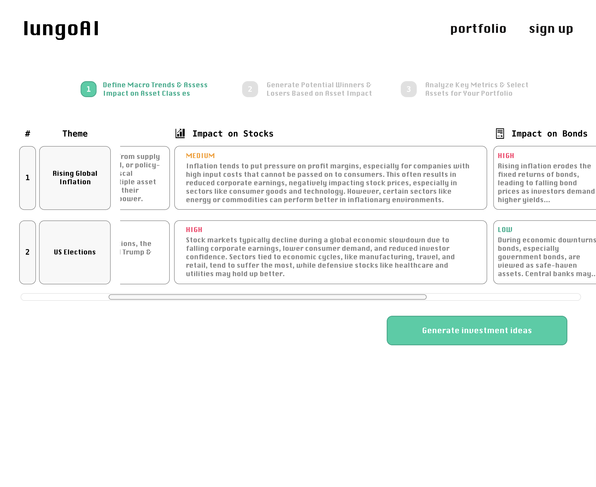
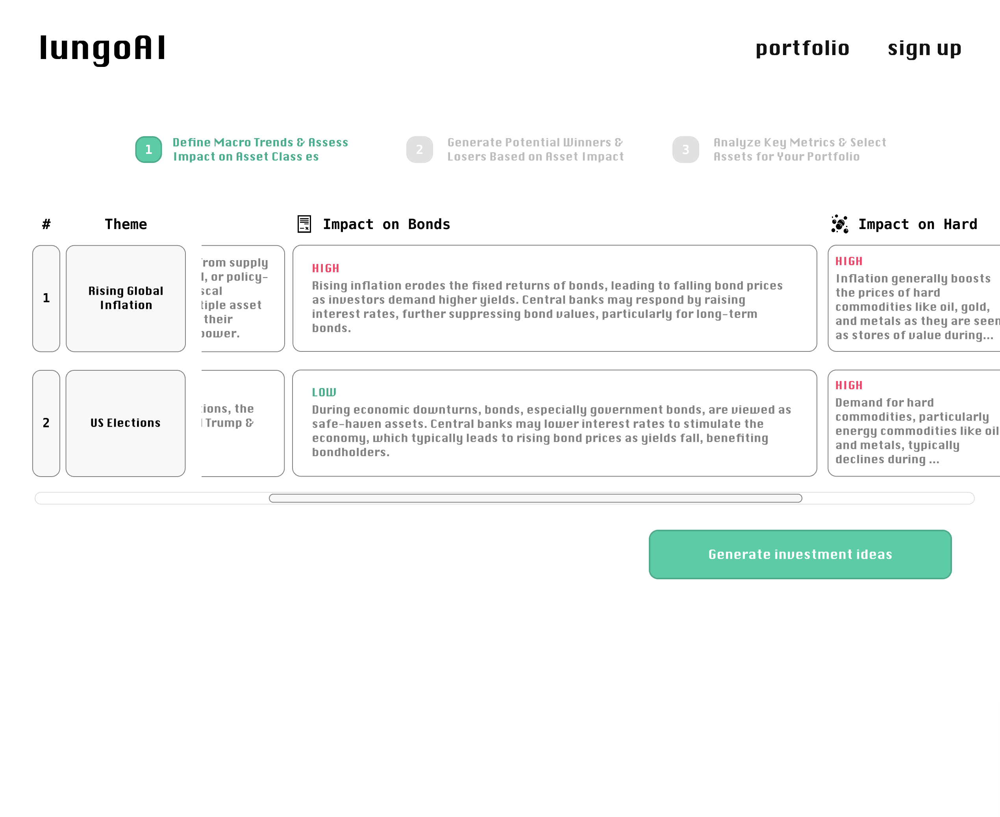
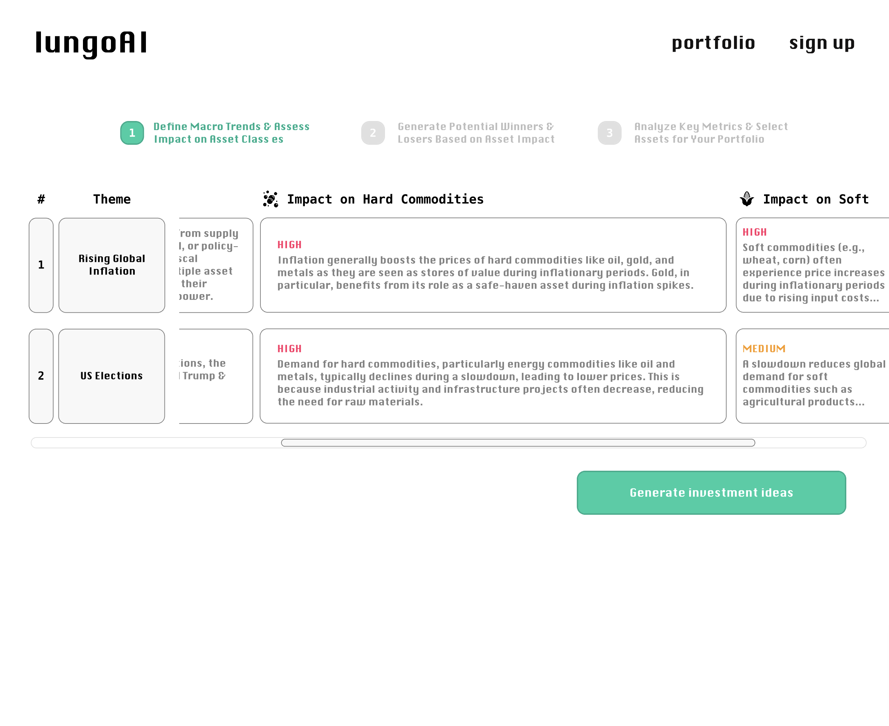
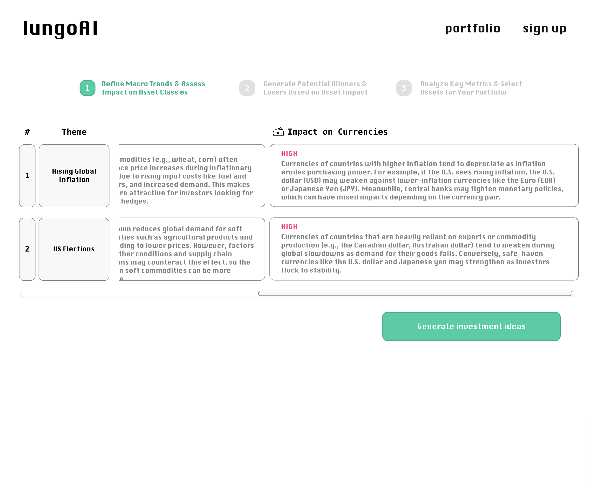
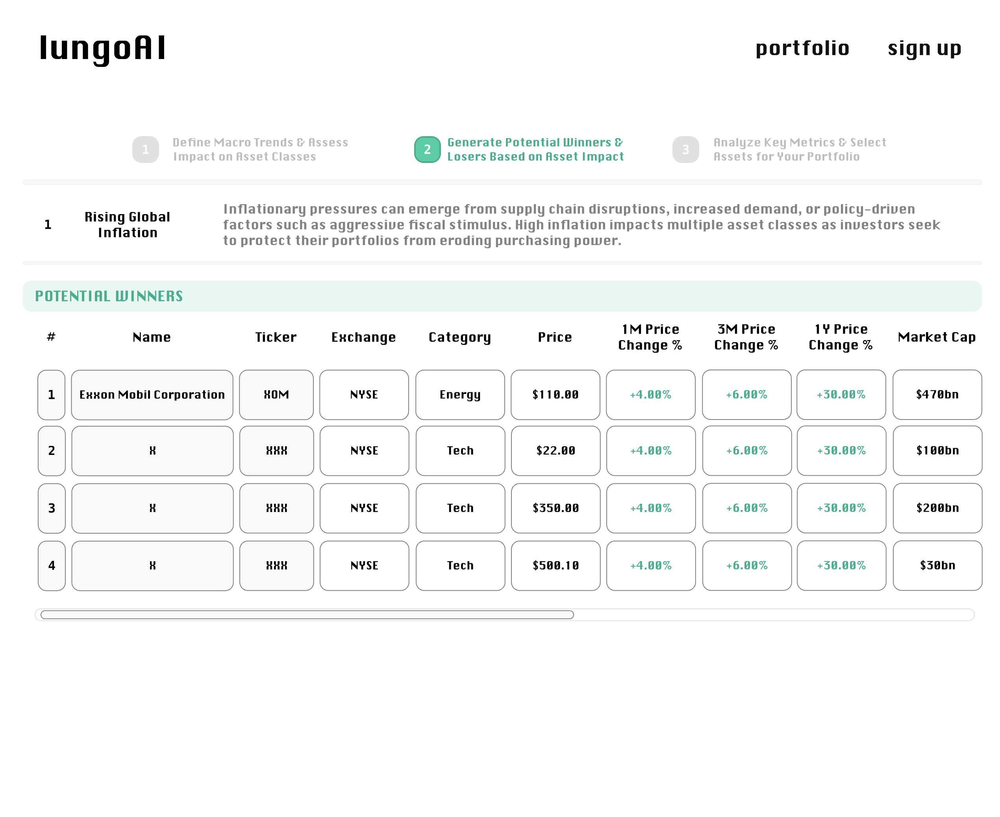
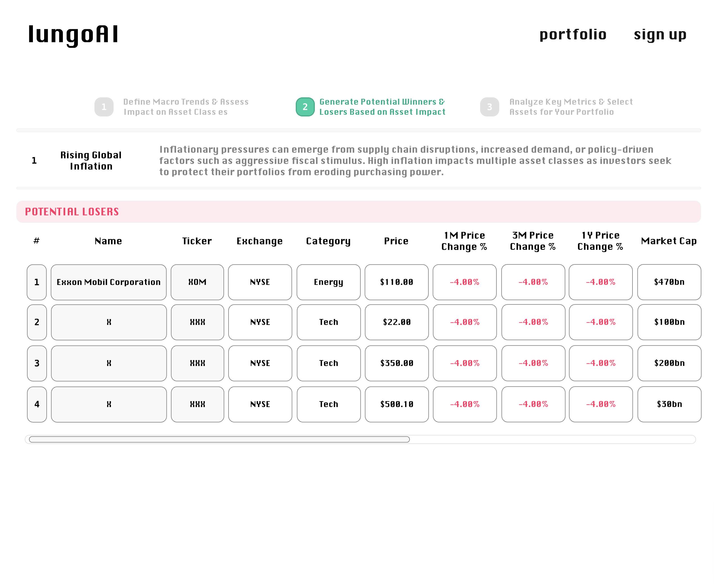
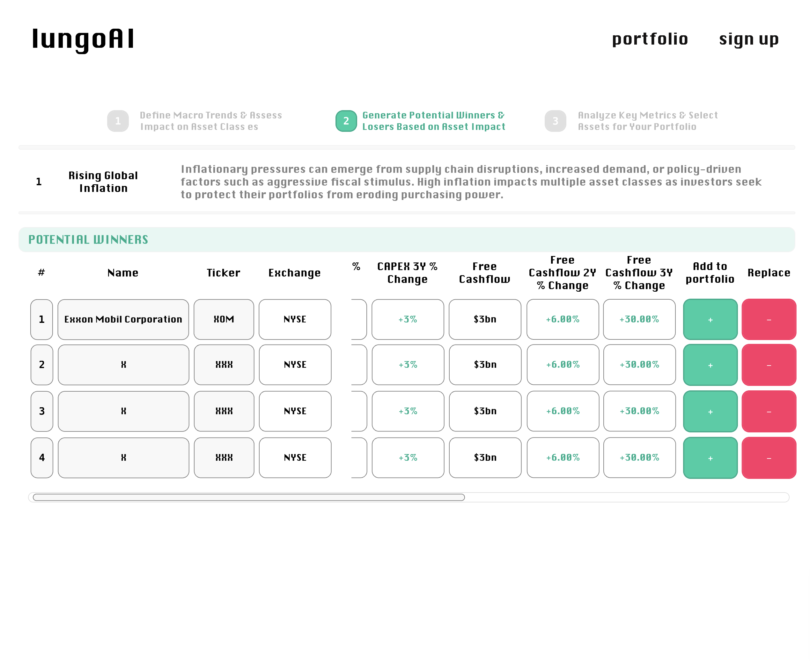

# LungoAI - AI-Powered Investment Insights for Retail Investors

## Overview

Lungo is an AI-driven investment app designed to help retail investors analyze macroeconomic trends and make informed decisions by identifying potential winners and losers across various asset classes. Users can define trends, generate stock ideas, analyze them based on key financial metrics, and build a portfolio for long-term success.

### Problem

The surge in retail investors over recent years, driven by technological advancements, the COVID-19 pandemic, and regulatory changes, has reshaped the financial markets. As of 2024, retail investors make up approximately 19.5% of the U.S. equity trading volume and control 52% of global assets under management (AUM), a figure projected to reach 61% by 2030. These investors are leveraging tools like commission-free trading apps and fractional share investing to gain market access, influencing corporate governance and market trends.

However, despite their growing presence, 70-90% of retail traders lose money, especially in speculative trading strategies like day trading and derivatives. Studies show that only the top 5% of retail traders account for 75% of all profits, while the majority struggle due to poor decision-making, lack of experience, and insufficient access to advanced tools and data. This gap highlights the need for a solution that provides retail investors with the same level of insights and resources as the top performers, empowering them to adopt more successful long-term strategies.

### User Profile

Target Audience:
Lungo is designed for retail investors who are looking to improve their investment decision-making through a better understanding of macroeconomic trends and advanced analysis tools. This includes:

1. Novice Investors: Individuals who are new to investing and are looking for guidance on how to understand market trends and build a long-term portfolio.
2. Experienced Retail Investors: Those who have traded before but are seeking advanced tools and insights to better navigate market complexities.
3. Long-term Investors: Users who prefer to build sustainable portfolios over time, rather than engaging in short-term speculative trading.

### Features

1. Macro Trend Definition & Asset Impact Analysis
   Users input macroeconomic trends (e.g., inflation, interest rate changes, technological advancements), and the app generates a detailed analysis of how these trends affect different asset classes such as stocks, bonds, commodities, and currencies.

2. Winners & Losers Generation
   Based on the impact analysis, the app identifies potential winning and losing assets across sectors, providing a list of stocks and other securities that are likely to benefit or suffer from each macro trend.

3. Financial Metric Evaluation
   Users can evaluate each asset using detailed financial metrics like price performance, valuation ratios (P/E, EV/EBITDA), and financial health indicators. The app will provide a comprehensive comparison to help users make informed decisions about adding assets to their portfolios.

4. Portfolio Management
   Users can create custom portfolios based on macro trends and assign weightings to each stock. The app will track performance and provide ongoing analysis of the portfolio based on changing market conditions.

## Implementation

### Tech Stack

1. Frontend: React.js or Vue.js for a responsive and interactive user interface.
2. Backend: Node.js with Express.js for API management and business logic.
3. Database: PostgreSQL for managing user data, trends, and portfolio information.
4. AI Integration: OpenAI's GPT API for generating macroeconomic insights.
5. APIs: Integration with Alpha Vantage, Yahoo Finance, or IEX Cloud for real-time stock and financial data.

### APIs

1. OpenAI GPT API: For generating AI-powered insights on the impact of macro trends on different asset classes.
2. Financial Markets API: one of the below (TBC):

- Alpha Vantage API: To pull real-time stock prices and financial data.
- Yahoo Finance API: For broader market data and historical trends.
- IEX Cloud API: To provide detailed financial metrics and stock data.

### Sitemap

1. Home Page: Introduction and overview of app features, login/signup options.
2. Macro Trend Input: Interface for users to input macroeconomic trends and view the impact on different asset classes.
3. Winners & Losers List: Display a list of assets (stocks, bonds, commodities) categorized as potential winners or losers based on the trend.
4. Asset Analysis: Detailed financial analysis for each stock, showing performance metrics and valuation ratios.
5. Portfolio Management: Allows users to create portfolios, allocate funds, and track performance over time.

### Mockups

### Data

1. User Data: Stores information on user trends, portfolios, and preferences.
2. Stock Data: Pulls real-time metrics and financial ratios from APIs to generate insights and analysis.
3. AI Data: Uses OpenAI’s GPT API to analyze trends and generate impact reports on different asset classes.

### Endpoints

Some basic endpoints, actuals TBD:

1. POST /api/trends: Accepts user-defined macroeconomic trends and generates an analysis report.
2. GET /api/stocks: Retrieves the list of winners and losers based on the selected trend.
3. POST /api/portfolio: Allows users to add assets to their portfolio.
4. GET /api/metrics: Fetches real-time financial data for selected assets.

### Auth

The app will use secure OAuth 2.0 authentication, allowing users to sign up or log in with services like Google or Apple. JWT tokens will be used for session management to keep the user logged in securely.

## Roadmap

Sprint 1:
Set up development environment.
Design wireframes and mockups.
Implement user authentication.
Integrate OpenAI GPT for macro trend analysis.

Sprint 2:
Build asset impact analysis and winners/losers list generation.
Implement portfolio creation and stock management features.
Conduct user testing and refine features.

Sprint 3:
Fine-tune metrics and real-time data integration.
Add notifications for stock price movements or macro trend changes.
Conduct final testing and prepare for release.

## Nice-to-haves

Sentiment Analysis: Analyze market sentiment using news and social media data.
Advanced Alerts: Set up triggers for specific market events or financial thresholds.
Social Investing: Introduce community features where users can see popular trends and portfolios.
